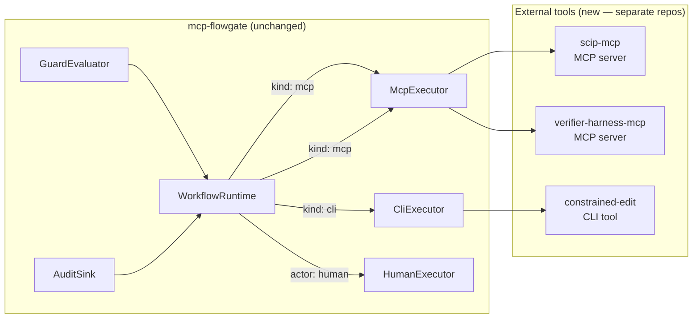

# RESEARCH.md vs SPEC.md + Codebase: Gap Analysis (Revised)

**Date:** 2026-05-24
**Status:** Revised — after recognising that RESEARCH.md "actors" decompose into
existing Flowgate primitives (states, guidance fragments, guards, executors).

---

## 1. The Core Insight: Actors *Are* Workflows

RESEARCH.md's actor model (Planner, Retriever, Editor, Verifier, Critic, Router,
Human-reviewer) looks like it describes seven distinct sub-systems. It doesn't.
Each actor decomposes into exactly the three primitives `mcp-flowgate` already
provides:

| Actor | State (position in graph) | Guidance (how to think) | Executor (deterministic tooling) |
|---|---|---|---|
| **Planner** | `planning` state | `plan.specify.change-request` skill fragment — normalise intent, define acceptance criteria, estimate blast radius | *None needed.* The model reads the issue + evidence and writes `normalizedProblem` to the blackboard. |
| **Retriever** | `retrieving` state | `diagnose.codebase.search` skill fragment — compose precise graph/semantic queries, assemble evidence pack | **Needs an executor** that queries SCIP symbol graphs, runs ripgrep, resolves CODEOWNERS. The model *composes the queries*; the executor *executes them deterministically*. |
| **Editor** | `editing` state | `implement.edit.constrained` skill fragment — produce only structured edit operations, explain rationale | **Needs an executor** that validates edit ops against the codebase and applies them. The model *proposes edits*; the executor *applies and validates*. |
| **Verifier** | `verifying` state | *None needed.* The executor is the authority; guidance would be misleading noise. | **Needs an executor** — the deterministic build/lint/test/mutation/coverage/security harness. RESEARCH.md is explicit: the verifier is "authoritative on pass/fail." |
| **Critic** | `critiquing` state | `review.code.adversarial` skill fragment — attack the patch for regressions, missed edge cases, policy violations | *None needed.* The model reads the diff + verifier artifacts and produces a verdict. |
| **Router** | *Guard logic, not a state* | *None.* Routing is policy, not cognition. | **Needs guard evaluator logic** — but guard evaluation already exists (`guards.rs`). The routing table (risk → escalate, retry budget → escalate, verifier pass → accept) is a guard list on a transition. |
| **Human-reviewer** | `human_review` state | `review.code.final-approval` skill fragment | `HumanExecutor` **already exists.** `actor: "human"` gates also already exist. |

**Conclusion:** The "actor model" gap is *mischaracterized*. Six of seven actors
are expressible as Flowgate states with guidance fragments. Three need new
executor implementations (Retriever, Editor, Verifier). One is just guard logic.
One already exists (Human-reviewer). The routing "actor" disappears entirely —
routing is what Flowgate guards do.

---

## 2. What's Actually Missing

### 2.1 Executors that need building (third-party tools, not Flowgate code)

These are the *irreducible gaps* — but they are **external systems**, not additions to
the `mcp-flowgate` crate. The existing executor landscape follows a clear pattern:

- **Heavy/domain-specific work** → external CLI, MCP server, or REST API, configured as
  a `connections:` entry and invoked via the existing `McpExecutor`, `CliExecutor`,
  or `RestExecutor`.
- **Governance-adjacent work** (structural analysis, dry-run, registry writes, ingest) →
  built-in executors that are small, stateless, and audit the host runtime.

All three SWE-agent executors fall into the "external" category. Nothing goes into
the Flowgate crate itself.

| Executor | Delivery | Transport | Purpose | Complexity |
|---|---|---|---|---|
| **Codebase graph** | External MCP server (`scip-mcp` or `codebase-graph-mcp`) | `McpExecutor` (existing) via `kind: mcp, connection: codebase_graph` | Expose SCIP symbol queries, call/import graphs, test coverage maps, CODEOWNERS lookups as MCP tools (`search_symbol`, `resolve_dependencies`, `find_tests`, `lookup_owner`) | **High.** Requires SCIP integration, index building, query API — all outside Flowgate. |
| **Constrained edit** | External CLI tool (`constrained-edit`) | `CliExecutor` (existing) via `kind: cli, connection: constrained_edit` | Accept `ConstrainedEditOp[]` as JSON on stdin, validate against codebase on disk, apply atomically, write unified diff to stdout. Rejects operations on forbidden paths. | **Medium.** File I/O + policy validation in a separate process with its own security boundary. |
| **Verifier harness** | External MCP server (`verifier-harness-mcp`) | `McpExecutor` (existing) via `kind: mcp, connection: verifier_harness` | Accept `HarnessRequest`, orchestrate containerised build → lint → fail-to-pass → pass-to-pass → coverage delta → mutation → security stages, return structured `HarnessResponse` with per-stage pass/fail + artifacts (JUnit XML, SARIF, coverage JSON, mutation JSON) | **High.** Container orchestration, multi-stage pipelines, artifact capture — all outside Flowgate. |

**Why external matters:** process isolation (a crashing linter doesn't crash the
workflow runtime), language freedom (each tool can be written in whatever language
best suits its domain), independent versioning (the verifier can iterate without
Flowgate releases), and security boundary (a compromised editor tool can't write
transition records).

### 2.2 Workflow definitions that need authoring (new YAML, not new code)

Once the executors exist, the SWE-agent pipeline is a Flowgate workflow:

```yaml
# Conceptual shape — not valid YAML, just illustrating the decomposition
workflows:
  swe_agent:
    version: 2026-05-24
    skills: [plan.specify.change-request, review.code.adversarial]
    blackboard: [normalizedProblem, acceptanceCriteria, risk, evidencePack,
                 candidatePatch, verifierResult, critique, retryCount]
    states:
      intake:
        transitions:
          start_planning:
            target: planning
      planning:
        goal: Normalise the change request
        skills: [plan.specify.change-request]
        transitions:
          plan_ready:
            target: retrieving
            guards:
              - expr: "$.context.normalizedProblem != null"
      retrieving:
        goal: Assemble evidence pack
        skills: [diagnose.codebase.search]
        executor: { kind: codebase_graph }
        transitions:
          evidence_ready:
            target: editing
            guards:
              - expr: "$.context.evidencePack != null"
      editing:
        goal: Produce constrained edits
        skills: [implement.edit.constrained]
        executor: { kind: constrained_edit }
        transitions:
          edits_produced:
            target: verifying
            guards:
              - kind: evidence
                requires: [{ kind: "candidate-patch", count: 1 }]
      verifying:
        executor: { kind: verifier_harness }
        transitions:
          verifier_passed:
            target: critiquing
            guards:
              - expr: "$.context.verifierPassed == true"
          verifier_failed:
            target: critiquing
            guards:
              - expr: "$.context.verifierPassed == false"
      critiquing:
        goal: Adversarial review of the patch
        skills: [review.code.adversarial]
        transitions:
          accept:
            target: human_review
            guards:
              - expr: "$.context.verdict == 'accept' && $.context.risk == 'high'"
          accept_low_risk:
            target: completed
            guards:
              - expr: "$.context.verdict == 'accept' && $.context.risk != 'high'"
          retry:
            target: retrieving
            guards:
              - expr: "$.context.retryCount < 3"
              - kind: expr
                expr: "$.context.verdict == 'retry'"
          escalate:
            target: human_review
            guards:
              - expr: "$.context.retryCount >= 3"
      human_review:
        actor: human
        transitions:
          approve: { target: completed }
          reject:  { target: drafting }
```

The routing policy table from RESEARCH.md (risk → escalate, retry budget →
escalate, touches auth → human) becomes **guard conditions** on transitions.
The cheap-first model selection becomes a guard that checks `retryCount` (first
attempt = cheap model, retry 2+ = medium/frontier). The governance is
*declarative*, not procedural.

### 2.3 Guidance fragments that need authoring (new skills YAML)

| Skill subject | Purpose | RESEARCH.md source |
|---|---|---|
| `plan.specify.change-request` | How to normalise a bug report/feature request into a typed problem statement with acceptance criteria | Planner role, ChangeRequestIR |
| `diagnose.codebase.search` | How to compose precise graph/symbol queries against the codebase | Retriever role, EvidenceRef |
| `implement.edit.constrained` | How to produce only the eight allowed edit operations; never propose raw shell commands | Editor role, ConstrainedEditOp |
| `review.code.adversarial` | How to attack a candidate patch for regressions, missed edge cases, security issues | Critic role, Critique |
| `review.code.final-approval` | Checklist for human reviewers of AI-authored patches | Human-reviewer role |

These are all static markdown blobs with a `verb` and `lifecycle` — exactly what
`mcp-flowgate`'s skills library already supports.

---

## 3. What Already Exists (no gap at all)

| RESEARCH.md concept | Flowgate equivalent | Status |
|---|---|---|
| "Deterministic control plane" | `WorkflowRuntime` + typed state machine | **Done.** |
| "Proposal-execution separation" | Guards validate; executors execute; the model proposes transitions | **Done.** |
| "Typed artifacts end to end" | `AuditEvent`, `transition-record.schema.json`, `workflow-response.schema.json` | **Done.** |
| "Repository-local system of record" | Versioned definition snapshots per instance (§8.2) | **Done.** |
| "Just-in-time retrieval" | HATEOAS surfacing of guidance refs; `gateway.describe` on demand (§5.4) | **Done.** |
| "Narrow role boundaries" | Actor-gated transitions; per-state skill scoping; blackboard typing | **Done.** |
| "Human remains final authority" | `actor: "human"` transitions + `HumanExecutor` + `Principal::is_human()` | **Done.** |
| "Observability" | Transition records (§7), date-rotated files, OpenTelemetry-ready audit events | **Done.** |
| "Cheap-first routing" | Guard-based escalation — expressible as guard conditions, no new code needed | **Expressible.** |
| "Failure taxonomy + repair" | Transition loops with guards (`retryCount < 3` → back to retriever; `retryCount >= 3` → human) | **Expressible.** |
| "Metrics collection" | Audit sink already records every transition + executor outcome + durationMs | **Expressible.** |

---

## 4. Revised Gap Taxonomy

### Category A: Needs new external tools (3 items — not Flowgate code)

1. **`scip-mcp` / `codebase-graph-mcp`** — MCP server wrapping SCIP symbol queries, call/import graphs, CODEOWNERS, test coverage mapping. Invoked via existing `McpExecutor`.
2. **`constrained-edit`** — CLI tool accepting `ConstrainedEditOp[]` on stdin, validating against codebase, producing unified diff. Invoked via existing `CliExecutor`.
3. **`verifier-harness-mcp`** — MCP server orchestrating build/lint/test/mutation/coverage/security stages in containers. Invoked via existing `McpExecutor`.

### Category B: Needs YAML workflow + skill authoring (zero new code — pure config)

4. SWE-agent workflow definition (states + transitions + guards as above, referencing external executors via `connections:`)
5. Five guidance skill fragments (planning, retrieval, editing, critique, human review)
6. `examples/swe-agent.yaml` — a complete, runnable example config wiring the three external tools into the workflow

### Category C: Needs minor Flowgate enrichments (light code in `mcp-flowgate-core`)

7. Metric extraction from existing audit events (cost per fix, retry count, latency, resolved rate) — could be a separate tool consuming the audit log, or a `metrics` endpoint on the gateway
8. Evidence-ref enrichment (add optional `digest` and `confidence` fields to the existing `Evidence` struct in `model.rs`)
9. Hierarchical trace/run/message IDs (add optional `traceId`, `runId` fields to the existing `AuditEvent` struct in `audit.rs`)

### Category D: Out of scope entirely (infra/ops decisions, not code)

10. Sandbox selection (gVisor vs Firecracker) — configured in the verifier harness MCP server's container runtime, not in Flowgate
11. Supply chain attestation (Sigstore, SLSA) — CI/CD pipeline integration, not a Flowgate concern
12. Model-tier selection at runtime — belongs to the LLM caller's routing layer; Flowgate provides audit records for the caller to make tier decisions

---

## 5. Does This Change the Original Conclusion?

**Yes, substantially.** The original analysis said 8 RESEARCH.md concepts had
"zero representation." With the actor→workflow decomposition, only 3 require
building anything — and those 3 are **external tools** (MCP servers + CLI), not
Flowgate code. The rest are **config, not code** — workflow definitions, skill
fragments, and guard-encoded routing tables that the existing runtime can
execute today.

### The architectural pattern: Flowgate proxies, doesn't absorb



Flowgate's `connections:` block already supports `kind: mcp` (child-process or
HTTP) and `kind: cli`. The three new tools plug in without a single line change
to the Flowgate runtime — they're configured, not compiled in.

The RESEARCH.md thesis — *cheaper models + better harnesses > expensive models
with poor controls* — is directly validated by the Flowgate architecture:

- **Guidance fragments** make cheap models competent by giving them precise,
  bounded "how to think" instructions (the inline+referenced tier system).
- **Guard-encoded routing** keeps cheap models on simple work and escalates only
  when risk or failure evidence justifies it.
- **External deterministic executors** (verifier, codebase graph) remove the
  failure modes that cheap models are most prone to: hallucinated tool use,
  wrong-file edits, and unverified "it works" claims — without coupling the
  governance layer to any specific tool implementation.
- **Transition records** provide the audit trail for A/B testing cheap-vs-expensive
  model performance on real tasks — the evaluation loop RESEARCH.md §5.6
  describes.

The bridge isn't missing. The bridge *is* the Flowgate runtime with its
`connections:` proxy model. What's missing is **authoring the workflow YAML,
writing the five skill fragments, and building the three external tools** —
all of which can proceed independently, in parallel, without touching the
Flowgate crate.

---

## 6. Implementation Priority

Following RESEARCH.md's own priority order (§Metrics, evaluation, and
implementation options):

1. **Author the SWE-agent workflow + five skills** (zero code — demonstrates the
   actor model is expressible in existing primitives; the workflow references
   executors by `connection:` name even before the tools exist)
2. **Build the three external tools** in priority order:
   - `verifier-harness-mcp` (highest leverage — makes "pass/fail" authoritative;
     can be developed and tested independently as a standalone MCP server)
   - `scip-mcp` (enables precise retrieval; reusable by any MCP client, not just
     Flowgate)
   - `constrained-edit` (enforces the edit boundary; simple CLI with no runtime
     dependencies)
3. **Minor Flowgate enrichments** (light code in `mcp-flowgate-core`):
   - Add optional `traceId`/`runId` to `AuditEvent`
   - Add optional `digest`/`confidence` to `Evidence`
4. **Wire metrics extraction** — consume the existing audit log to produce the
   RESEARCH.md scorecard (resolved rate, cost per fix, retry count, etc.)
5. **Build example evaluation workflows** that replay audit logs into the
   RESEARCH.md metric families

Each step is independently useful and shippable. The external tools can be
built, tested, and versioned in separate repositories — the Flowgate workflow
only needs the `connections:` block to reference them. No orchestration changes
needed in the Flowgate runtime.
